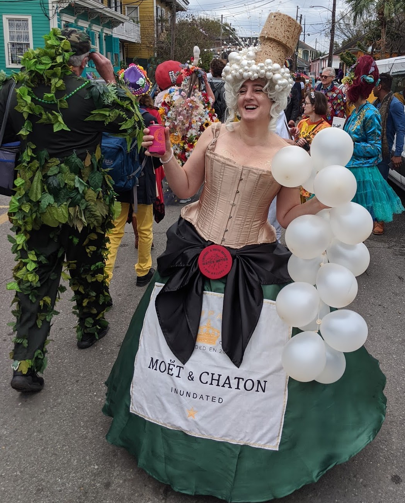
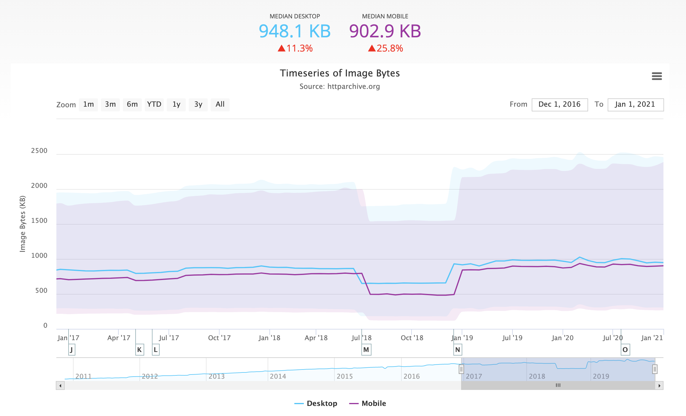
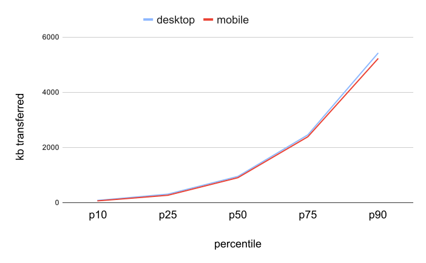
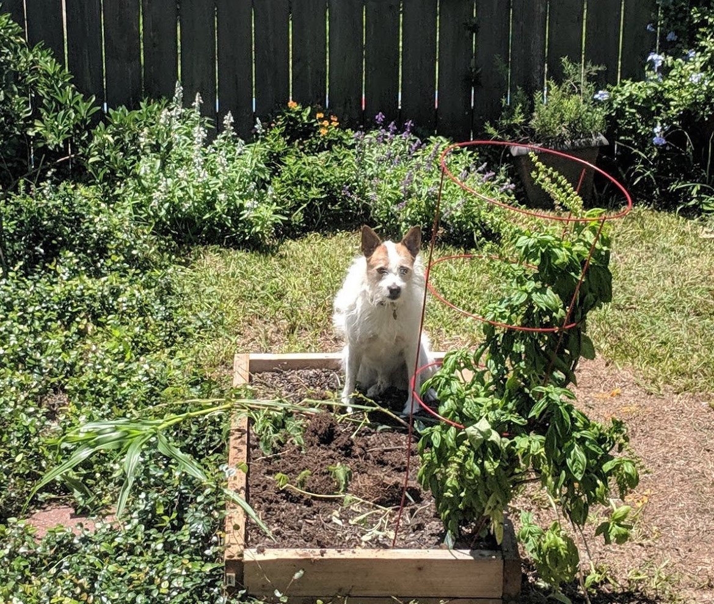
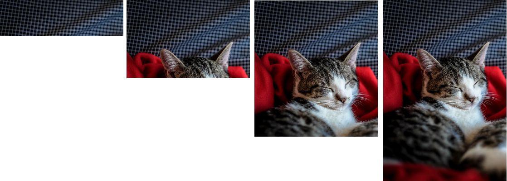
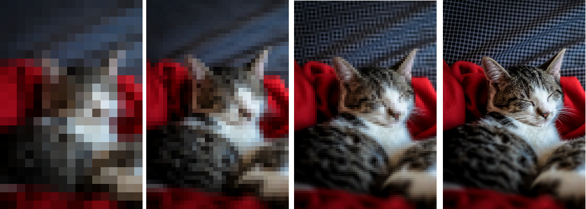
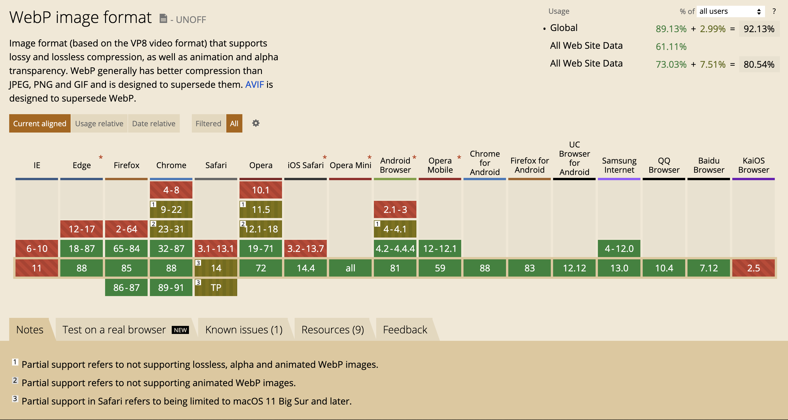
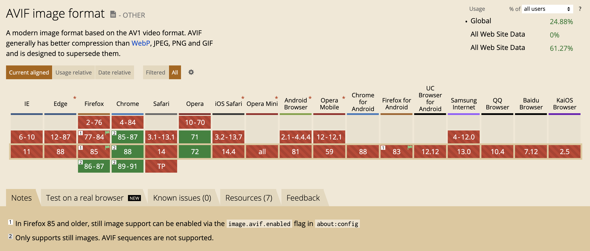
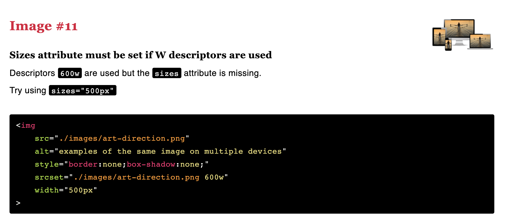
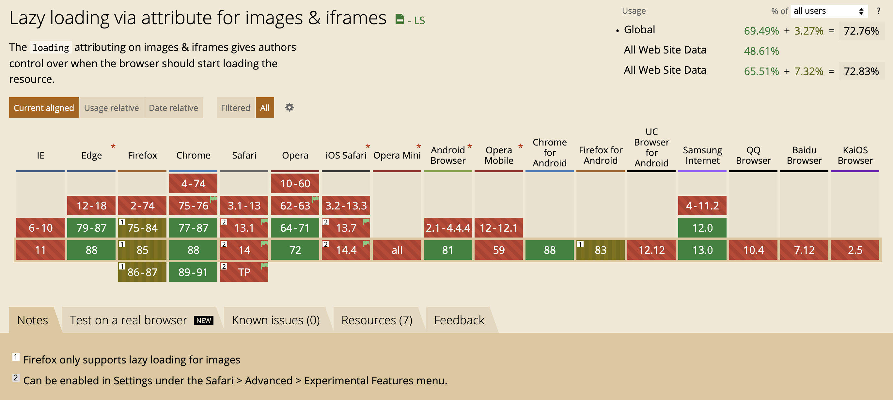

<!-- .slide: data-background="./images/yellow-camera.jpg" -->
<h1 class="title" style="text-align:left;">Responsive Images<span class="translucent"> for the Web</span></h1>
<h2 class="subtitle" style="color:#333;text-align:left;">Sia Karamalegos</h2>

---

## hi, i'm sia

[sia.codes](https://sia.codes/)



---

<!-- TODO -->
## [bit.ly/web-images-2020](http://bit.ly/web-images-2020)

---


Images account for 48% of the bytes transferred <br>(median) needed to load a mobile webpage.

<small>[httparchive.org](https://httparchive.org), January 2021</small>

---



<small>[httparchive.org](https://httparchive.org), January 2021</small>

---

## kB by Percentile



<small>[httparchive.org](https://httparchive.org), January 2021</small>

---

# #Goals

---

<large style="font-size: 48px">Users shouldn't download<br> unnecessary bytes. 💾</large>

---

<large style="font-size: 48px">Images should look good. 💅🏼</large>

---

<large style="font-size: 48px">Stop the layout shift. ✋🏽</large>

---

## Responsive &amp; Optimized Toolbox 🧰

- Best file format <!-- .element: class="fragment fade-in-then-semi-out" -->
- Right size and resolution <!-- .element: class="fragment fade-in-then-semi-out" -->
- Art direction <!-- .element: class="fragment fade-in-then-semi-out" -->
- Lazy loading <!-- .element: class="fragment fade-in-then-semi-out" -->

---

<!-- .slide: data-background="./images/disk-drive.jpg" class="dark-highlighter" -->

# File Format <!-- .element: class="dark-background" style="color:#fecf16" -->

---

> Choosing the right image format... can be far more important than any flashy new “responsive image” technique.

<small>Mat Marquis, [Image Performance](https://abookapart.com/products/image-performance)</small>

Note: Responsive Issues Community Group (RICG) chair. Getting the right image format is more important than any responsive image technique.

---

## Raster vs Vector


<small>https://commons.wikimedia.org/wiki/File:Bitmap_VS_SVG.svg</small>

Note: Raster images contain a set of data about a 2D grid of pixels. Vectors are a system of coordinates and "vectors" than can be redrawn at any size. Rasters are good for photo-realism. Raster file formats are really just different compression methods.

---

<svg version="1.1" width="300" height="200" xmlns="http://www.w3.org/2000/svg"><rect width="100%" height="100%" fill="turquoise" /><circle cx="150" cy="100" r="80" fill="rebeccapurple" /><text x="150" y="125" font-size="60" text-anchor="middle" fill="white">SVG</text></svg>

```xml
<svg version="1.1"
     width="300" height="200"
     xmlns="http://www.w3.org/2000/svg">

  <rect width="100%" height="100%" fill="turquoise" />
  <circle cx="150" cy="100" r="80" fill="rebeccapurple" />
  <text x="150" y="125" font-size="60"
        text-anchor="middle" fill="white">SVG</text>
</svg>
```

Note: (vector) - best for limited colors and sharp lines (e.g., logos)

---

## GIF

Just. Don't.

<video controls width="700" autoplay loop>
  <source src="./images/dont.mp4" type="video/mp4">
  Sorry, your browser doesn't support embedded videos.
</video>

Note: (lossy) - fun but terrible. Use SVG or video instead. Inspect this (or on Twitter) and see that's it's video.

---

## PNG: photo-like images with transparency


Note: (lossless) - best for photo-realistic with transparency. **Lossless compression** - like using ZIP for a file but all the data is still saved.

---

## JPG: photo-like images with no transparency



Note: JPG is your photo workhorse. It's a lossy format that was created to compress by hue - in a way that human eyes are less likely to detect, so it's smaller than PNG. Use for all:

---

## Progressive JPG




<small>[What is a progressive JPEG?](https://www.liquidweb.com/kb/what-is-a-progressive-jpeg/) by Liquid Web</small>

Note: hard to tell when an image has actually finished loading. You might even get a bad impression from a website because “the photos look blurry” (while in fact the site was still loading and you only saw a progressive preview of the photos)

---

## WEBP: best of both worlds



<small>[caniuse](https://caniuse.com/#feat=webp)</small>

Note: WEBP is a new format available on most modern browsers (I'm looking at you, Safari) that combines the best of JPG and PNG with smaller sizes. It's lossy or lossless and supports transparency.

---

## AVIF: the future



<small>[Equal file sizes demo](https://jakearchibald.com/2020/avif-has-landed/#at-equal-file-sizes) by Jake Archibald, [caniuse](https://caniuse.com/avif)</small>

Note: AVIF is an extraction from the keyframes of the now popular video format AV1. Best compression, supports transparency and more.

---

## Cheatsheet

- ✅ SVG: logos and icons <!-- .element: class="fragment fade-in-then-semi-out no-bullet" -->
- ❌ GIF: don't. use jpg for a still or video for animation. <!-- .element: class="fragment fade-in-then-semi-out no-bullet" -->
- ✅ PNG: photo-like images with transparency <!-- .element: class="fragment fade-in-then-semi-out no-bullet" -->
- ✅ JPG: photo-like images with no transparency <!-- .element: class="fragment fade-in-then-semi-out no-bullet" -->
- ✅ WEBP: smaller, but need to serve fallbacks <!-- .element: class="fragment fade-in-then-semi-out no-bullet" -->
- ✅ AVIF: EVEN SMALLER, but need to serve fallbacks <!-- .element: class="fragment fade-in-then-semi-out no-bullet" -->

<small>[Responsive Doggos Demo](https://projects.sia.codes/responsive-images-demo/)</small>

Note: Raster file formats are really just different compression methods. **SVG**: Can style and animate with CSS or make basic edits in XML. **GIF**: huge file sizes for animation, use video instead. svg or jpg are better for stills. Twitter converts GIF to video.  **PNG**: Use jpg if don't need transparency. **JPG**: much better compression algos.

---

<!-- .slide: data-background="./images/stormtrooper.jpg" -->

# Size &amp; Resolution <!-- .element: style="color:#333; text-align:left;" -->

&nbsp;

&nbsp;

&nbsp;

&nbsp;

---

## Demystifying DPR (device pixel ratio)

On a 2x screen, a displayed image width of 100px needs a 200px file/natural width image to look good.


Note: n this exaggerated example, the natural width of the bantha doggo on the left is 150px, then 300px, then 600px. The display width is 300px, and my screen has a DPR (device pixel ratio) of 2. 150px is fuzzy. Looking closely, the middle image is not the best quality either.


---

## `srcset`

```html

```


Note: States a set of images and the natural size of each image. Browser assumes a display width of 100vw.  Files are candidates, not commands.. Alternatively, use x-descriptors.

---

## `sizes`

```html

```

Note: States display width for a set of media conditions. Order matters! First match is used. No media condition for the last one (default for no match). Add analogous CSS.

---

## RespImageLint FTW 🏆



<small>[RespImageLint bookmarklet](https://ausi.github.io/respimagelint/)</small>

---

<!-- .slide: data-background="./images/elder-phone.jpg" -->

Note: How many different resolutions? Science suggests humans can see 720ppi 1 foot from a screen. The iPhone 11 is 326ppi (MBP is 227) so in most cases, you're safe providing only 1x and 2x. You might consider 4x in cases of high-resolution projectors or art.

---

<!-- .slide: data-background="./images/chilis.jpg" -->

&nbsp;

&nbsp;

&nbsp;

&nbsp;

# Art Direction <!-- .element: style="text-align:right;color:#111;" -->

---


Note: (1) Art direction is a technique for drawing attention to the most important parts, or targeting specific features of an image, even when it’s viewed on different devices or platforms. (2) So how do we do art direction?

---

## `<picture>`

```html
<picture>
  <source media="(min-width: 800px)"
          srcset="wide_800.jpg 800w,
                  wide_1600.jpg 1600w">
  <source media="(min-width: 400px)"
          srcset="narrow_400.jpg 400w,
                  narrow_800.jpg 800w">
  
</picture>
```

Note: Provides image candidates based on device size, resolution, orientation, and more. Use `media` attribute for viewport spec. First match is used. Always provide `` last for no match or browsers that do not support `<picture>` and `<source>` (1) In this `picture` tag, we have 2 sources and an img. Older browsers simply ignore the picture and source tags and use the img tag. (2) The video tag also works this way and can have multiple `source` tags

---

## Bleeding-Edge File Formats (WEBP & AVIF!)

```html
<picture>
  <source type="image/avif" srcset="pug_life.avif">
  <source type="image/webp" srcset="pug_life.webp">
  
</picture>
```

Note: Browser uses the first compatible file type. Set `` `src` to a format supported by all browsers.

---

## CSS Background Images

- Use media queries for width and DPR
- Use postcss/autoprefixer to get prefixes

```css
@media only screen and (min-width: 320px) {
  /* small screen, DPR = 1 */ }
@media only screen and (min-device-pixel-ratio: 2) and (min-width: 320px),
  only screen and (min-resolution: 192dpi) and (min-width: 320px),
  only screen and (min-resolution: 2dppx) and (min-width: 320px),{
  /* small screen, DPR = 2 */ }
```

Note: When should an image be in the HTML vs CSS?

---

## webp, srcset, &amp; sizes, oh my! 🦁🐯🐻

```html
<picture>
  <source srcset="./images/sofa_pug_400.avif 400w,
                  ./images/sofa_pug_800.avif 800w"
          type="image/avif" />
  <source srcset="./images/sofa_pug_400.webp 400w,
                  ./images/sofa_pug_800.webp 800w"
          type="image/webp" />
  
</picture>
```

---

<!-- .slide: data-background="./images/photo-collage.jpg" class="dark-highlighter" -->

# Generating Images & Markup <!-- .element: style="color:#fecf16;" -->

---


<small>[Images on the Command Line reference](https://github.com/siakaramalegos/images-on-the-command-line), [Tweet](https://twitter.com/TheGreenGreek/status/1201494377522225153)</small>

---

## Paid Services 💰

- [Cloudinary](https://cloudinary.com/)
- [Netlify large media](https://docs.netlify.com/large-media/overview/#large-media-docs)
- ...and many others

```bash
[baseUrl]/eeeps/image/upload/f_auto,q_70,w_512/photo.jpg
/images/apples.jpg?nf_resize=fit&w=300&h=400
```

<small>[Image Analysis Tool by Cloudinary](https://webspeedtest.cloudinary.com/)*</small>

---

## Cloudinary + Eleventy

`f_auto` means we can skip the picture tag!

`[baseUrl]/image/upload/f_auto,q_70,w_512/photo.jpg`

```html

```

<small>[Eleventy and Cloudinary images](https://sia.codes/posts/eleventy-and-cloudinary-images/)</small>

Note: AVIF is not yet supported

---

## Other tooling options:

- Simple `` and server/serverless function selects best image to serve
- Build tools like various webpack loaders (but `sizes` not supported)
  - [responsive-loader](https://github.com/herrstucki/responsive-loader)
  - [gatsby-image](https://www.gatsbyjs.org/packages/gatsby-image/) and [gatsby-transformer-sharp](https://image-processing.gatsbyjs.org/)


Note: (1) Many people have their server hijack the request and serve the best image to minimize markup. Could also use a serverless function. (2) Cost money. (3) So many options - both create your srcset code and process the images

---

# `display: none;`
# not a perf strategy.

Note: Some browsers will still load hidden images.

---

<!-- .slide: data-background="./images/falling-mountains.jpg" class="dark-highlighter" -->

# Layout Shift

---

<video controls width="800" autoplay loop>
  <source src="./images/layout-shift.mp4" type="video/mp4">
  Sorry, your browser doesn't support embedded videos.
</video>

---

```html

```

```css
img {
  height: auto;
  /* max-width: 100%; */
}
```

<small>[Do This to Improve Image Loading on Your Website](https://www.youtube.com/watch?v=4-d_SoCHeWE&feature=youtu.be) - video by Jen Simmons</small>

Note: Setting the height and width on the image sets an aspect ratio, and then the CSS is respected.

---

<video controls width="800" autoplay loop>
  <source src="./images/fixed-layout-shift.mp4" type="video/mp4">
  Sorry, your browser doesn't support embedded videos.
</video>

---

<!-- .slide: data-background="./images/loading.jpg" class="dark-highlighter" -->

# Loading <!-- .element: style="color:#fecf16;" -->

---

## ⚡🦄🌈⚡ Native lazy-loading ⚡🦄🌈⚡

```html
<!-- Lazy-load offscreen image when user scrolls near -->


<!-- Load an image immediately -->

```

<small>[addyosmani.com/blog/lazy-loading/](https://addyosmani.com/blog/lazy-loading/)</small>

---

# ⚡🦄🐈🌈🐼🍕🎂🍾🎉🐶🦄🐈🌈🐼🍕🎂🍾🎉🐶⚡🐈🌈🐼🍕🎂🍾🎉🐶⚡🦄🌈🐼🍕🎂🍾🎉🐶⚡🦄🐈

---

# 😭😭😭😭😭😭



<small>[caniuse](https://caniuse.com/#feat=loading-lazy-attr)</small>

---

In the meantime, use a tool like [lazysizes](https://github.com/aFarkas/lazysizes).

<small>Also check out: [Lazy load embedded YouTube videos](https://css-tricks.com/lazy-load-embedded-youtube-videos/) on CSS Tricks</small>

Note: Can also do a blur-up and calculate sizes for you.

---

## Toolbox 🧰

- Use the right image type (png vs jpg, gif vs video). <!-- .element: class="fragment fade-in-then-semi-out" -->
- Serve the right size image for the user's screen width and device pixel ratio <!-- .element: class="fragment fade-in-then-semi-out" -->
- Compress images with a tool like ImageOptim, TinyPNG, or use a webpack plugin like imagemin-webpack-plugin <!-- .element: class="fragment fade-in-then-semi-out" -->
- Use newer, improved formats like webp. <!-- .element: class="fragment fade-in-then-semi-out" -->
- Lazy loading with a tool like lazysizes <!-- .element: class="fragment fade-in-then-semi-out" -->

<br>
<br>
<small>
  Check out <a href="https://developer.mozilla.org/en-US/docs/Learn/HTML/Multimedia_and_embedding/Responsive_images">Responsive images</a> on MDN &amp; <a href="https://abookapart.com/products/image-performance">Image Performance</a> by Mat Marquis.
  <br><a href="https://www.npmjs.com/package/sharp">Sharp</a> &amp; <a href="https://www.imagemagick.org/script/index.php">Imagemagick</a> are great for resizing images. Examples at <a href="https://web.dev/fast/serve-responsive-images">Serve Responsive Images</a>. Use cwebp for creating webp files (<a href="https://developers.google.com/speed/webp/docs/cwebp">docs</a>).
</small>

---

<!-- .slide: data-background="./images/yellow-camera.jpg" -->
<h1 class="title" style="text-align:left;">Thanks!</h1>

<p style="color:#333;text-align:left;">Slides:<br> <a href="http://bit.ly/web-images-2020" class="link-secondary">bit.ly/web-images-2020</a></p>
<p style="color:#333;text-align:left;">30 Days of Web Perf:<br> <a href="http://bit.ly/30-days-web-perf" class="link-secondary">bit.ly/30-days-web-perf</a></p>
<p style="color:#333;text-align:left;">Writing, resources, and more:<br> <a href="https://sia.codes/" class="link-secondary">sia.codes</a></p>


---

## Photo credits

- Title slide - [Malte Wingen](https://unsplash.com/@maltewingen?utm_source=unsplash&utm_medium=referral&utm_content=creditCopyText)
- File format slide - [Patrick Lindenberg](https://unsplash.com/@heapdump?utm_source=unsplash&utm_medium=referral&utm_content=creditCopyText)
- Stormtrooper lego in sand - [Daniel Cheung](https://unsplash.com/@danielkcheung?utm_source=unsplash&utm_medium=referral&utm_content=creditCopyText)
- Loading bay - [Hannes Egler](https://unsplash.com/@egla?utm_source=unsplash&utm_medium=referral&utm_content=creditCopyText)
- Chilis and tiles - [Toa Heftiba](https://unsplash.com/@heftiba?utm_source=unsplash&utm_medium=referral&utm_content=creditCopyText)
- Older person using phone - [Joseph Chan](https://unsplash.com/@yulokchan?utm_source=unsplash&utm_medium=referral&utm_content=creditCopyText)
- Instant photo collage - [Soragrit Wongsa](https://unsplash.com/@invictar1997?utm_source=unsplash&utm_medium=referral&utm_content=creditCopyText)
- Man falling from mountains - [Joanna Nix](https://unsplash.com/@joanna_nix?utm_source=unsplash&utm_medium=referral&utm_content=creditCopyText)
